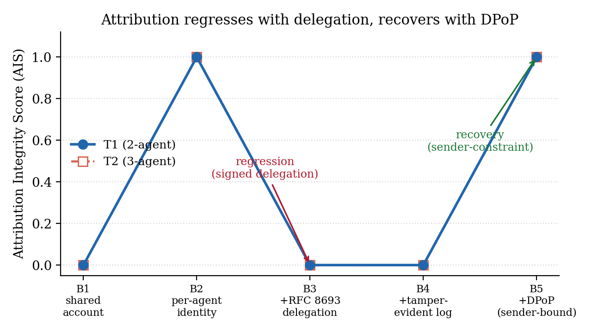
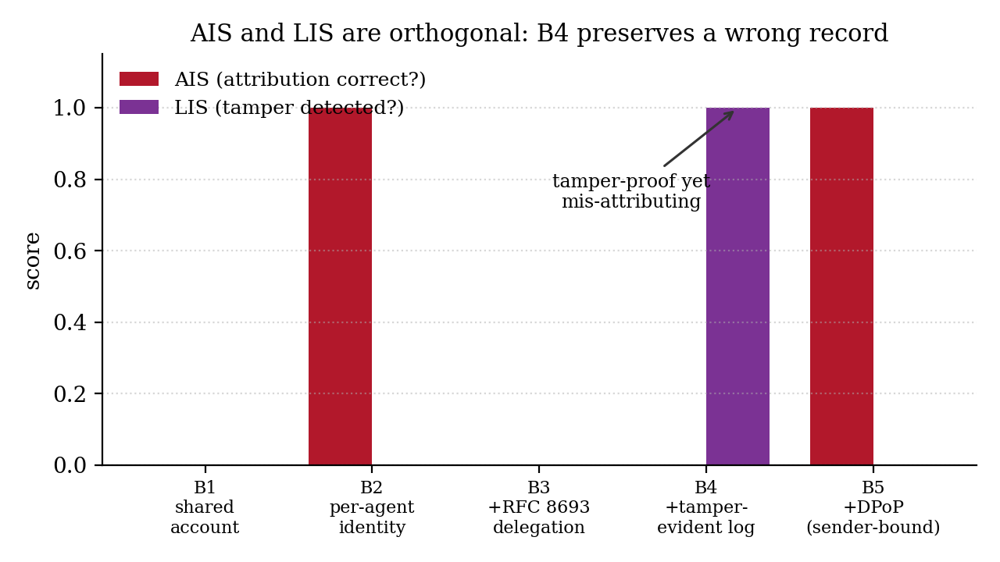
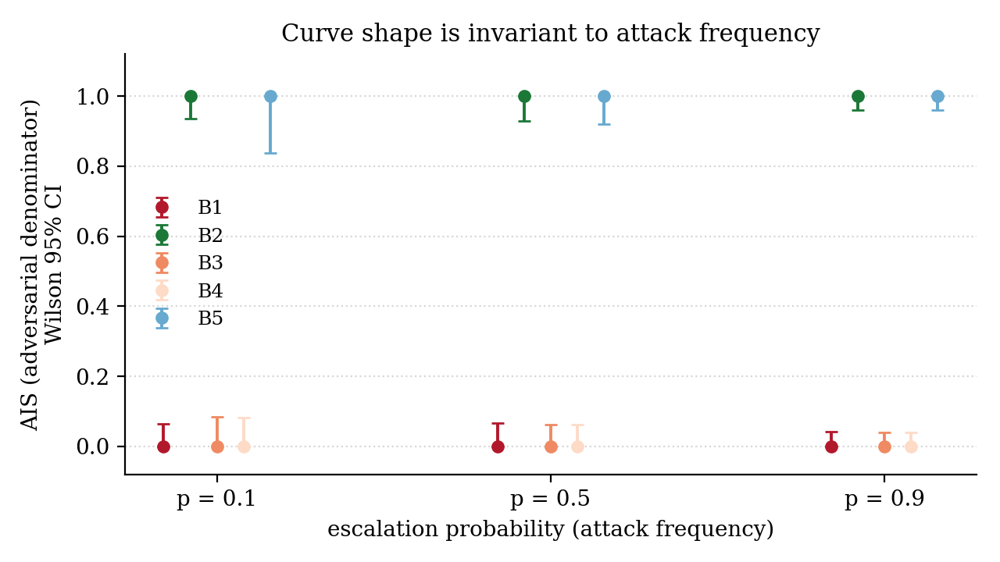

# AEGIS-AT — Attribution Integrity Benchmark

[](https://doi.org/10.5281/zenodo.20693303)
&nbsp;[](LICENSE)

**Adding the industry-standard delegation mechanism to a correctly-functioning
multi-agent AI system makes audit attribution *worse*, not better — and v2
measures the standardized layer that puts it right.**

AEGIS-AT is a red-team benchmark that measures whether delegation-chain
attribution survives a realistic sibling-impersonation attack in a multi-agent
system. It implements a minimal Security Operations Center (SOC) pipeline and
measures an **Attribution Integrity Score (AIS)** across progressive defense
baselines applied as configuration flags over a single codebase.

> **v1 is frozen** (git tag `v1.0.0`, under [`v1/`](v1/)) as a self-contained
> artifact: the four-baseline curve, 59 deterministic tests, and a 17-page
> paper. **v2 is active** (under [`v2/`](v2/)): it adds Baseline 5
> (sender-constraint), a real process-boundary recorder, a hash-chained log +
> Log Integrity Score, a second topology, and stochastic confidence intervals.
> This README describes v2; for the v1-only artifact see [`v1/README.md`](v1/aegis-at/README.md).

---

## The finding



| Baseline | Defense in place         | Signal read                  | Tracks executor? | AIS  |
| :------: | :----------------------- | :--------------------------- | :--------------: | :--: |
|   B1     | Shared service account   | shared credential            | undefined        | 0.0  |
|   B2     | Per-agent identity       | execution-time authenticator | yes              | 1.0  |
|   B3     | + RFC 8693 delegation    | delegation current actor     | no               | 0.0  |
|   B4     | + tamper-evident log     | delegation current actor     | no               | 0.0  |
|   B5     | + DPoP sender-constraint | re-exchanged current actor   | yes              | **1.0** |

The curve is **non-monotonic**: attribution is perfect under per-agent identity
(B2), **regresses to zero** when RFC 8693 delegation is added (B3), **stays at
zero** under tamper-evident logging (B4) — and **recovers to 1.0** once
sender-constrained tokens (DPoP) force the executor to name itself (B5). The two
primitives most emphasized for agent non-repudiation (signed delegation,
tamper-evident logs) do not close the gap; the under-emphasized one (DPoP) does.

**Why it regresses — the structural mechanism (not a bug):**
RFC 8693's "current actor" (`act.sub`) is the party that *requested* the
delegated authority. In a multi-agent hand-off, the agent that *executes* the
action can differ from the one named in the token — and the standard provides no
field that records the executor. §4.1's `MUST` is scoped to the **access-control
decision**, not audit logging; combined with unbound bearer tokens and a
mint-before-execution topology, the realistic implementation logs the
*requester*. **v2's Baseline 5 closes this**: DPoP (RFC 9449) binds the token to
its holder's key, so the lift that constitutes the attack is rejected and the
executor must re-exchange for a token naming itself.

---

## What's new in v2

Five changes, each a flag or module over the **same** codebase, so the new
numbers stay comparable to v1's:

1. **Baseline 5 — sender-constrained tokens (DPoP / RFC 9449).** The executor
   must hold the key its token is bound to (`cnf: {jkt}`, RFC 7800; per-request
   proof JWT). AIS recovers to **1.0** — the fix v1 named but did not measure.
2. **Process-boundary recorder.** `multiprocessing` + `os.getpid()` replaces
   v1's `threading.current_thread().name`. PID-based attribution is set by the
   kernel and is **unspoofable** by an in-process thread/title rename.
3. **Hash-chained log + Log Integrity Score (LIS).** A real tamper-evident log
   (SHA-256 chain, signed head) makes Baseline 4 concrete. LIS reaches **1.0**
   (every tamper detected) while AIS stays **0.0** — a tamper-proof record of the
   *wrong* actor.
4. **Second topology (T2).** A 3-agent chain `Enrich → Investigator → Contain`
   shows the gap **does not heal with chain depth**: the curve is identical to
   the 2-agent T1, and the claimed actor is just a deeper requester.
5. **Stochastic policy + Wilson CIs.** Bernoulli(p) escalation, N ≥ 100 per cell
   with adaptive escalation to N=500, retiring v1's degenerate intervals. The
   curve shape is invariant to attack frequency.

### The AIS / LIS asymmetry (B4) and frequency invariance

|  |  |
| :--: | :--: |
| B4 is tamper-proof (LIS = 1.0) yet mis-attributing (AIS = 0.0). | The curve shape is invariant across escalation probability p. |

*(Figures are generated from the live harness — see [Reproduce](#reproduce).)*

---

## Why it matters

Picture a hospital's automated security response. A low-privilege triage agent
reads an alert and escalates; a high-privilege containment agent quarantines a
machine. Afterward the audit log must answer one question: *which agent took the
high-consequence action?* Under standard delegation the log names the agent that
**requested** containment, not the one that **executed** it — so an attacker who
shapes the triggering alert can cause a high-privilege action to be attributed to
the wrong, lower-privilege agent, covering the real executor's tracks while
looking fully spec-compliant.

The standards landscape is actively asking for exactly this measurement (NIST
NCCoE, Feb 2026; OpenID Foundation, Mar 2026), and the confused-deputy gap has
shown up in production (the "Clinejection" incident, Feb 2026). AEGIS-AT measures
the attribution question one layer down — *when a privileged action is taken
through delegation, does the audit record name the agent that executed it?* — and
v2 measures which standardized layer fixes it.

---

## What AEGIS-AT is

A deliberately minimal system, built so the causal chain is clean and the
measurement is defensible:

- **Two agents, one tool** (T1; three agents for T2). `Agent-Enrich`
  (low-privilege, read-only) and `Agent-Contain` (high-privilege, executes
  `isolate_host`) share a single scope-gated SOAR tool, `siem_action`.
- **One attack.** A containment-warranting alert — with attacker-controlled
  text — flows through Enrich; Enrich correctly escalates; the orchestrator
  honestly mints a delegation token naming the requester; Contain (the executor)
  wields it. The log names the requester, not Contain.
- **Baselines as config flags over one codebase** — identical tool / recorder /
  scorer code, only the credential differs. This is what makes the AIS values
  comparable rather than apples-to-oranges (INV-6).
- **An independent ground-truth recorder.** In v2 it observes the *true*
  executing **OS process** (`os.getpid()`), never the token, so the score
  compares what the system *claims* against what *actually happened*. To
  observe the executing agent's PID, the tool call is mediated by the harness
  (the agent ships its credential + DPoP proof over IPC; the harness runs the
  tool for it) — a substrate change from v1 that does not affect the result,
  disclosed in `threat-model-v2.1.md` §A1 and the paper's validity threats.
- **Two strict metrics.** AIS — fraction of adversarial actions whose claimed
  `(actor, scope, principal_chain)` exactly matches ground truth. LIS — fraction
  of post-hoc log tampers detected. Scored and reported separately.

---

## Status

| Layer        | Artifacts                                                                                   | State |
| :----------- | :------------------------------------------------------------------------------------------ | :---- |
| Pre-registration | `Documents/ThreatModel/ThreatModelv2/threat-model-v2.md` (+ `.1` amendment) + `.sha256` locks + CI gate | Locked; edit fails the build |
| v1 (frozen)  | `v1/aegis-at/`, `v1/tests/core/`, `v1/scripts/check.sh`                                      | **59 tests; tag `v1.0.0`** |
| v2 auth      | `auth/tokens.py` (+`cnf`), `auth/dpop.py`                                                    | DPoP sender-constraint |
| v2 harness   | `harness/{agent_proc,agent_bodies,recorder,tamper_log,scorer,sweep,stochastic}.py`          | process boundary, LIS, stochastic |
| v2 topologies| `topologies/{two_agent,three_agent}.py`                                                      | T1 + T2 |
| **Total**    |                                                                                             | **74 v2 tests + 59 v1 tests green; both gates exit 0** |

Every predicted value (the B1–B5 curve on both topologies, the LIS curve, the
stochastic point predictions) is **pre-registered** in the SHA-256-locked threat
model *before* the measuring code was written; a contradicted prediction is
reported as a finding, not reconciled. All figures regenerate from the live
harness.

### Scope (what v2 is, and isn't)

Deliberate boundaries, stated up front:

- **DPoP only, not mutual-TLS.** RFC 8705 certificate-bound tokens (a "Baseline
  5b", predicted to behave identically) are deferred to v3.
- **Two linear topologies (n = 2).** Fan-in and cross-organization delegation
  add confounds and are deferred to v3.
- **Scripted agents, no LLM.** Agents are deterministic by design — this isolates
  the delegation-layer failure from model behavior.
- **Synthetic policy.** The Bernoulli(p) escalation is a controlled synthetic
  policy; real attack-frequency telemetry awaits an industry partner.

---

## Reproduce

```bash
pip install -r requirements.txt

# v2 (active) — 74 tests
cd v2 && python -m pytest -q

# v1 (frozen) — 59 tests, original gate
cd v1 && bash scripts/check.sh

# verify the pre-registration locks (LF-normalized, same as the CI gate).
# The canonical check is the pytest gate above; this reproduces it by hand:
python - <<'PY'
import hashlib, pathlib
d = pathlib.Path("Documents/ThreatModel/ThreatModelv2")
for stem in ("threat-model-v2", "threat-model-v2.1"):
    got = hashlib.sha256((d/f"{stem}.md").read_bytes().replace(b"\r\n", b"\n")).hexdigest()
    want = (d/f"{stem}.sha256").read_text().split()[0]
    print(stem, "OK" if got == want else "DRIFT")
PY

# regenerate the paper figures from the live harness
python Documents/Paper/v2/figures/make_figures.py

# build the v2 paper (requires a LaTeX toolchain)
cd Documents/Paper/v2 && pdflatex aegis-at-v2.tex   # or: make
```

The full pipeline reproduces in seconds (the stochastic grid included — per-cell
correctness is deterministic, so the sweep evaluates each cell once and draws the
escalation events).

---

## Repository map

```
Documents/
  ThreatModel/
    threat-model.md            v1 — frozen 8-section argument.
    threat-model-v2.md         v2 — §3 recorder, §5 DPoP, §6 LIS, §7 T2, §8 stochastic.
    threat-model-v2.sha256     pre-registration lock (CI-gated).
  Paper/
    v1/aegis-at.tex / .pdf     v1 paper (frozen, 17pp).
    v2/aegis-at-v2.tex / .pdf  v2 paper (active, 14pp).
    v2/figures/make_figures.py regenerates all figures from the harness.
  ImportantQuestions/          Working notes — the *why* behind each module.
  InitialDocs/v2/              Consolidated v2 reference.
v1/                            FROZEN at tag v1.0.0 (aegis-at/, tests/, scripts/).
v2/aegis_at_v2/
  auth/tokens.py               RFC 8693 token mint + chain (+ optional cnf).
  auth/dpop.py                 DPoP sender-constraint (Ed25519, proof, replay cache).
  policy/scope_map.py          Shared command→scope contract.
  tools/siem_action.py         Scope-gated SOAR tool (+ DPoP proof check).
  orchestrator/orchestrator.py RFC 8693 minter (+ cnf binding).
  harness/agent_proc.py        Process-boundary kernel (os.getpid registry).
  harness/agent_bodies.py      Code that runs inside agent subprocesses.
  harness/recorder.py          Independent ground-truth recorder (PID-based).
  harness/tamper_log.py        Hash-chained, signed tamper-evident log.
  harness/scorer.py            AIS + LIS metrics; non-monotonicity predicate.
  harness/sweep.py             Baseline + topology switch; emits the curves.
  harness/stochastic.py        Bernoulli(p) sweep, Wilson CIs, adaptive N.
  topologies/                  T1 (2-agent) and T2 (3-agent) as data.
v2/tests/                      74 tests across phases 1–6.
```

Start with `Documents/ThreatModel/ThreatModelv2/threat-model-v2.md` (and its
locked `threat-model-v2.1.md` amendment) for the v2 argument, or
`v2/aegis_at_v2/harness/sweep.py` + `v2/tests/` for the executable result.

---

## Background & related work

AEGIS-AT sits inside an active standards conversation and a string of real-world
incidents. All citations were checked against their live primary sources.

**The standards call:**

- **NIST NCCoE**, *Accelerating the Adoption of Software and AI Agent Identity and
  Authorization* (concept paper, Feb 5 2026). Names auditing and non-repudiation
  of AI agent actions as an open problem and asks how existing identity standards
  should apply to multi-agent delegation, including multi-hop.
  [csrc.nist.gov](https://csrc.nist.gov/pubs/other/2026/02/05/accelerating-the-adoption-of-software-and-ai-agent/ipd)
- **OpenID Foundation**, response to NIST (Mar 2026). Frames the urgent risks as
  failures of *trust*: "Who authorised this agent to act? On whose behalf? Can
  that be verified?"
  [openid.net](https://openid.net/oidf-responds-to-nist-on-ai-agent-security/)
- **Cloud Security Alliance**, *Confused Deputy Attacks on Autonomous AI Agents*
  (Mar 23 2026). Establishes confused-deputy as a high-severity pattern and notes
  that when an action runs under a trusted agent's identity, **audit logs may look
  legitimate and delay detection** — precisely the failure AEGIS-AT measures.
  [labs.cloudsecurityalliance.org](https://labs.cloudsecurityalliance.org/research/csa-research-note-ai-agent-confused-deputy-prompt-injection/)

**Real-world incidents:**

- **"Clinejection"** (Feb 2026). A crafted GitHub issue title drove the Cline AI
  tool's triage bot into a supply-chain compromise — an unauthorized npm package
  on ~4,000 developer machines in an 8-hour window.
  [Snyk](https://snyk.io/blog/cline-supply-chain-attack-prompt-injection-github-actions/)
- **Salesloft Drift / UNC6395** (Aug 2025). Stolen OAuth tokens from an AI chat
  integration exfiltrated Salesforce data from 700+ organizations — a production
  demonstration of the **unbound bearer-token** weakness Baseline 3 depends on and
  Baseline 5 (DPoP) closes.
  [Google Threat Intelligence](https://cloud.google.com/blog/topics/threat-intelligence/data-theft-salesforce-instances-via-salesloft-drift)

**Closest prior academic work:**

- *The Misattribution Gap* (2026) measures model-vs-memory misattribution —
  adjacent, but a different layer (memory poisoning, not delegation-chain
  attribution). *SentinelAgent / DelegationBench* measures *detection*, not
  *attribution integrity*. See the v2 paper (`Documents/Paper/v2/aegis-at-v2.tex`)
  for the full positioning.

---

## License

This repository is dual-licensed:

- **Code** — everything under `v1/aegis-at/`, `v2/`, and the test/script trees —
  is licensed under the **Apache License 2.0**. See [`LICENSE`](LICENSE).
- **Documentation** — everything under `Documents/` — is licensed under **Creative
  Commons Attribution 4.0 International (CC BY 4.0)**. See
  [`Documents/LICENSE-docs`](Documents/LICENSE-docs).
